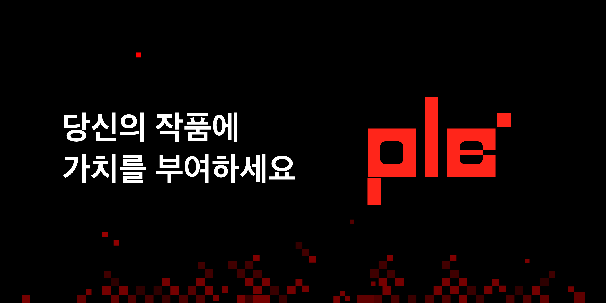

# RECRUIT-LIO-STUDIO
🚀 스타트업 리오 스튜디오에서 함께 성장할 개발 팀원을 모집합니다 🚀

안녕하세요. 모든 아티스트의 표현의 자유와 소통의 공간을 제공하는 리오 스튜디오입니다. 리오 스튜디오는 2023년 1월 “아티스트의 퍼스널 브랜딩을 돕는다”라는 미션으로 예술계의 문제를 해결하고 혁신하기 위해 설립된 스타트업입니다. 

### 💡 사업 개요

3D 모델 기반의 콘텐츠 산업의 증가로 수요는 늘어나고 있으며 이를 활용한 메타버스, 웹툰, 영상, 영화, VR/AR 등 다양한 사업이 빠르게 성장하고 있습니다. 하지만 3D 모델러들은 개인의 작품을 표현할 온라인상 공간과 동종업계의 종사자들 간의 소통 역시 부족합니다. 리오 스튜디오는 3D 모델러 및 창작자 중심의 3D 모델 유통 서비스 PIE를 도입하여 국내 3D 모델 시장의 활성화와 많은 아티스트들의 퍼스널 브랜딩을 도와 더 나아가 국내 3D 기반의 예술 산업의 발전에 기여하고자 합니다. AR 기반의 3D 모델 뷰어, 커스터마이징 개인 페이지, 여러 마케팅 서비스 제공을 통해 모든 아티스트의 창작과 성장을 돕고자 합니다.

### 💡 사업화 현황

- PIE 플랫폼 MVP 100% 자체 개발
- AR 기반 3D 모델 뷰어 기술 자체 개발 완료
- 디지털 저작권 관련 기술(DRM, DOI 등) 연구중
- 초기 공급자 32명+ 확보 완료
- 8월 정식 제품 출시 예정 ([https://pie.ink](https://pie.ink))
- 코너스톤웍스 창조기업 지원센터 프로그램 참여 중 (사무실, 멘토링, 마케팅, 법률 등 지원)
- 예비창업패키지 소셜벤처 분야 통과, 발표 심사 대기중 그 외 다수 지원 사업 참여

### 💡 팀 소개

Co-Founder 3인 + 팀원 4인 총 7인으로 구성되어 있으며 역할 중심 조직이 아닌 문제 해결 조직으로 기존에 어떤 커리어를 갖고 있는지 보다도, 관습에 얽매이지 않고 필요하면 무엇이든 배워서 문제를 해결한다는 자세로 성장하고 있습니다. 팀의 성장이 곧 개인의 성장이 되도록 환경 설계에 노력하고 있으며 실패를 통해 성공을 배우는 그릿(Grit)이 있는 융합형 문제 해결 조직입니다.

- [윤상석] 공동 대표, 경영 전략 및 개발 총괄 : 인류에 가치 창출을 하기 위한 소명으로 수학, 소프트웨어, 경영을 전공했습니다. 자신이 가진 지식을 통해 교육에 기여하고자 인프런에서 지식 공유자로 활동하고 있으며 2권의 IT 도서를 집필 중입니다. 총 16 건의 개발 아웃소싱, 5회 프로젝트 매니징을 했습니다. 메이커 스타트업에서 웹 개발자로 근무했으며 삼성, LG, GS 리테일에서 멘토 제안을 받았으나 현재 예술계의 문제를 해결하기 위해 리오 스튜디오를 창업하여 경영 전략, 개발을 총괄하고 있습니다.
- [윤예림] 공동 대표, 경영 전략 및 디자인, 브랜딩 총괄 : 소통하며 디자인한다는 것을 철학으로 여러 창업 프로젝트를 바탕으로 무에서 유를 창조해나가며 성장하고 있습니다. 스타트업에서 디자인 디렉터로서 근무, 도전 학기 프로젝트를 통한 창업 경험, 회사(제일기획, MLB) 실무 경험을 통해 얻은 인사이트를 바탕으로 아티스트를 위한 브랜드, 리오 스튜디오를 설립하였습니다. 그리고 현재 국내 3D 국내 모델러 시장을 활성화시키기 위해 PIE를 준비하고 있습니다.
- [이홍주] 공동 창업자, 콘텐츠 총괄 및 경영 지원 : 창작자들의 고충해결과 소통 활성화를 목표로 팀에 참여하게 되었습니다. 도예/유리와 예술학을 전공하였으며, 미술 전공생으로서 제가 가진 경험을 바탕으로 예술계에 긍정적 변화를 일으키고자 합니다. 예술의 여러 분야를 직접 경험하기 위해 신라호텔 공예 갤러리 휴크래프 인턴, 공예품 판매 페어 참가, 크라우드 펀딩 400만원 프로젝트 달성 등의 이력이 있습니다. 3D예술 시장 활성화라는 더 큰 목표 실현을 위해 리오스튜디오에 합류하게 되었고, 현재 라운디드,EQL,SSG.com, 29cm 등의 공예품 판매 온라인 플랫폼에 입점예정이며, 팀 내에서 Co-Founder로서 콘텐츠 총괄 및 경영지원 등을 담당하고 있습니다.

### 💡 근무 조건

- 시간/기간 협의 가능
- 오피스: 서울특별시 서초구 강남대로 342 벤처스페이스 (강남역 5분 거리)
    - 학업 병행 가능, 언제든지 편하게 사무실 오셔서 공부 하셔도 됩니다!
    - 맛있는 군것질 제공
- 매달 매출 수익의 5% 정산 (성과에 따라 추가 배분 가능)
- 개인의 성장이 팀의 성장이 될 수 있도록 소프트웨어 강사 출신 개발자(윤상석)가 직접 멘토링 해드립니다.
- 개발자 네트워킹 참여 기회 제공

### 💡 모집 안내

🌟 자격 요건에 다소 부족하더라도 업무에 대한 열정, 책임감 등 배움, 성장의 의지가 강하신 분이라면 환영합니다!

📍 웹 프론트엔드 개발자 (2명)

- 웹 퍼블리싱(HTML / CSS)에 능숙한 분
- 기초적인 협업 스킬(Git,  Github)이 있으신 분
- 기초적인 Javascript, React 지식이 있으신 분
- 사용자 편의 중심으로 사고하여 문제를 해결하는 분
- 메타버스, NFT, 아트 등에 관심이 있으신 분

🌟 리오 스튜디오는 아래의 기술 스택을 사용합니다.

- Typescript, Node.js ⇒ 제품 개발
- Python ⇒ 데이터 분석, 인공지능, 관리자 대쉬보드
- Git, Github, Zeplin, Notion ⇒ 협업
- VSCode, Pycharm ⇒ 코드 에디터
- AWS ⇒ 클라우드

### 🗓️ 모집 일정

- 지원 마감: 4/25(금)
- 인터뷰 진행: 4/26(화) ~ 5/1(토) 오후 1시~7시 (날짜 및 시간 협의 가능)
    - 인터뷰는 약 30분 정도 소요되며 상황에 따라 온/오프라인으로 진행할 예정입니다 :)
- 최종 합격자 안내: 5/2(월) 오후 1시

### 📌 지원방법

- 구글 설문지 작성 : [https://forms.gle/5qk73NzMD2CZJmqU7](https://forms.gle/5qk73NzMD2CZJmqU7)
- 스타트업과 창업에 관심이 있고 최소한의 지식과 성장 의지만 있다면 누구나 지원 가능합니다.
- 자율적이고 수평적인 문화를 지향하며, 개인의 능력 개발과 여가 생활을 보장하기 위해 노력하고 있습니다.

### 🌈 편하게 문의해주세요!

- Kakao: [https://open.kakao.com/o/sdhzOVWd](https://open.kakao.com/o/sLMvKlbe)
- Email: pie.liostudio@gmail.com
- 인스타그램 : [@lio__studio](https://www.instagram.com/lio__studio/?igshid=YmMyMTA2M2Y=) / [@whatliogazes](https://www.instagram.com/whatliogazes/?igshid=YmMyMTA2M2Y=)

